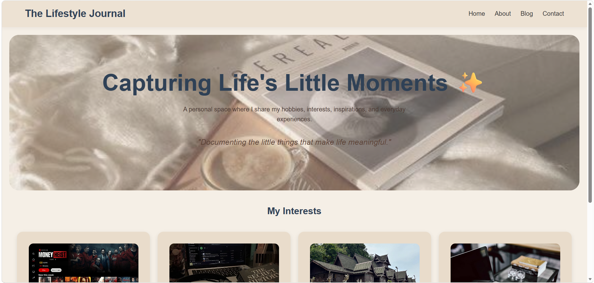
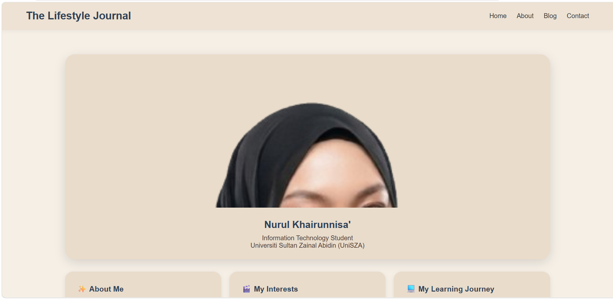
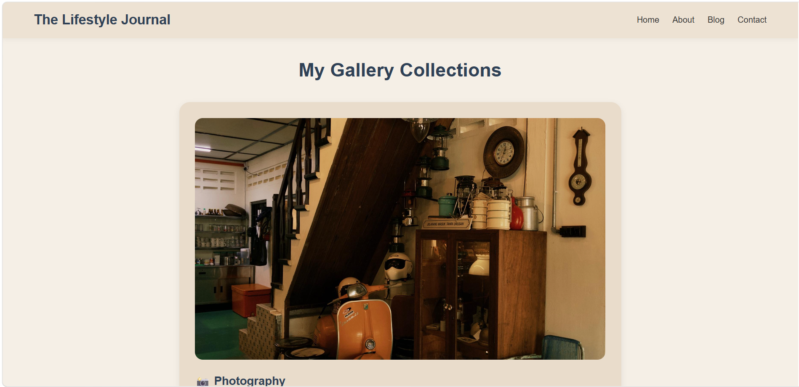
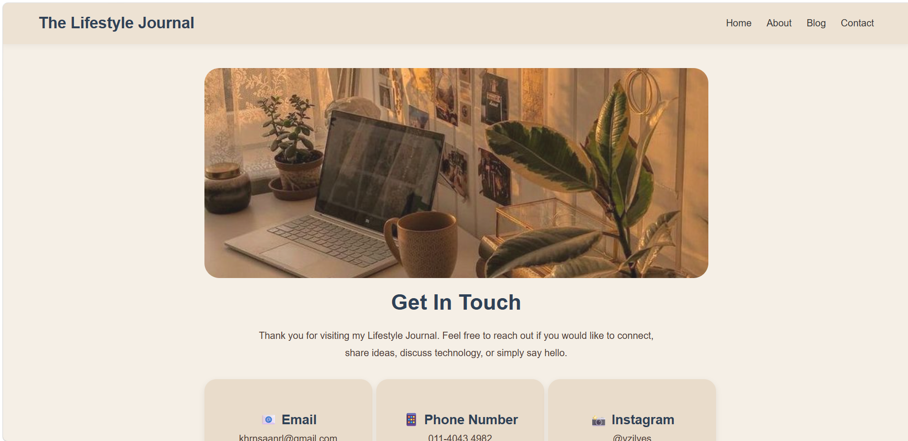
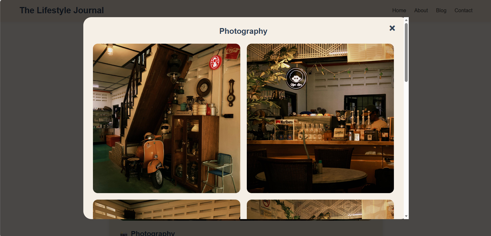

# The Lifestyle Journal

## Description

The Lifestyle Journal is a personal portfolio website developed using HTML, CSS, and JavaScript. The website showcases my interests, experiences, photography collections, creative projects, and learning journey in web development.

The purpose of this project is to create a responsive and visually appealing personal portfolio while applying front-end web development skills.

---

## Features

- Responsive website design
- Home page with introduction section
- About page with personal background and interests
- Photography gallery
- Food hunting gallery
- Travel diary gallery
- Creative projects gallery
- Interactive pop-up image gallery using JavaScript
- Contact page with social links and contact information

---

## Technologies Used

- HTML5
- CSS3
- JavaScript

---

## Screenshots

### Home Page

### About Page

### Gallery Page

### Contact Page

### Gallery Popup

## How to Run the Project

1. Download or clone the repository.
2. Open the project folder.
3. Open index.html in a web browser.
4. Navigate through the website using the navigation menu.

---

## Demo Link

GitHub Repository:
https://github.com/khrnsaanrl-cmd/The-Lifestyle-Journal-portfolio

GitHub Pages:
https://khrnsaanrl-cmd.github.io/The-Lifestyle-Journal-portfolio/The-Lifestyle-Journal-portfolio-main/
---

## Learning Outcomes

Through this project, I improved my skills in:

- HTML page structuring
- CSS styling and responsive design
- JavaScript interactivity
- UI/UX design
- Portfolio website development

---

## Author

Nurul Khairunnisa' Binti Khairul Nizam

Bachelor of Information Technology (Informatics Media) with Honours

Universiti Sultan Zainal Abidin (UniSZA)
